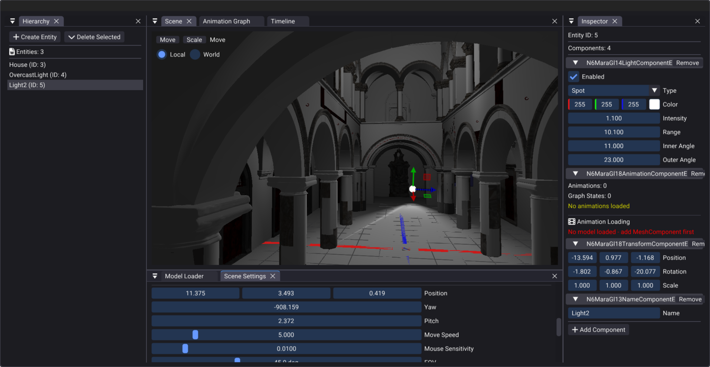
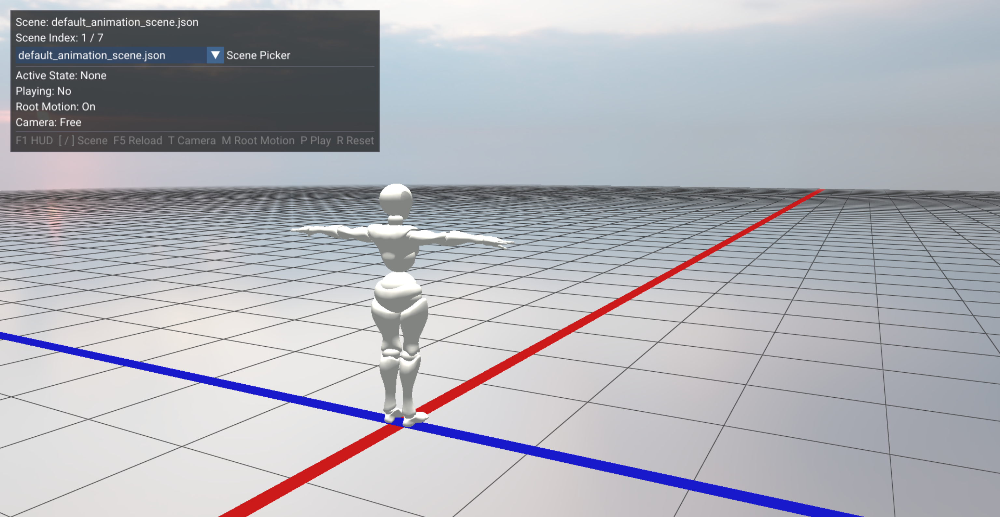
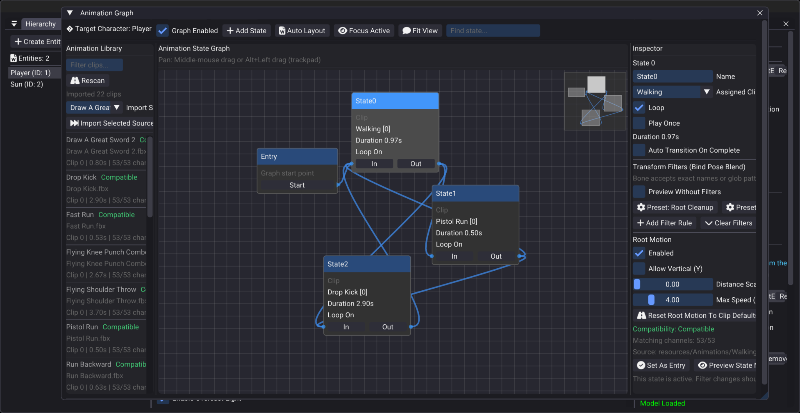

# MaraGl

> **Heavy note:** This project is in a **pre-alpha development stage**. Features are incomplete, behavior may change without notice, and you should expect bugs, rough edges, and missing content.

MaraGl is an OpenGL-based 3D graphics engine with two runnable frontends:

- an editor for assembling and inspecting scenes
- a sandbox runtime for testing scenes without the editor UI

It currently focuses on scene loading, model rendering, animation playback, animation graphs, root motion, camera control, and async asset loading.

## Screenshots

### Editor



### Sandbox Runtime



### Animation Graph / Timeline



## What It Can Do Right Now

### Editor

- Load `.json` scenes and display them in a docked ImGui-based editor
- Create and inspect entities with components such as transform, mesh, light, name, and animation graph data
- Browse the scene hierarchy and inspect selected entity properties
- Load models from disk and assign materials and textures
- Edit animation graphs, transitions, input bindings, and root motion settings
- Scrub and preview animation timeline behavior
- Load skyboxes and render scene previews in a framebuffer-backed viewport
- Show async loading progress while models are being prepared

### Sandbox Runtime

- Load scenes from `.json` files using the same scene-loading pipeline as the editor
- Preload models asynchronously and attach them to scene entities when ready
- Render the loaded scene directly in the main window without editor panels
- Play and test animation graphs, triggers, and input bindings
- Toggle third-person camera behavior and root motion
- Cycle through available scenes from the HUD or with keyboard shortcuts
- Show loading progress in the window title while assets are being prepared

## Controls

### Editor

- Drag and dock panels through the editor UI
- Use the scene hierarchy, inspector, model loader, timeline, and scene settings panels to author content

### Sandbox

- `F1` toggle HUD
- `[` and `]` previous / next scene
- `F5` reload current scene
- `T` toggle third-person camera
- `M` toggle root motion
- `P` play / pause animation
- `R` reset animation state

## Project Layout

```text
core/      Engine runtime, scene system, rendering, animation, asset loading
editor/    Full editor application and ImGui panels
sandbox/   Lightweight runtime viewer for gameplay-style testing
resources/ Shaders, fonts, images, and skyboxes
scenes/    Example scene JSON files
vendor/    Third-party libraries
```

## Building

The project is built with CMake.

## Cloning From GitHub

Clone the repository with all submodules and vendor dependencies initialized:

```bash
git clone --recursive https://github.com/lewis-2000/MaraGl.git
```

If you already cloned it without `--recursive`, initialize the submodules afterward:

```bash
git submodule update --init --recursive
```

```bash
mkdir -p build
cd build
cmake ..
cmake --build . -j$(nproc)
```

The main executables are:

- `editor`
- `sandbox`

## Notes

- The editor is meant for authoring and inspection.
- The sandbox is meant for testing runtime behavior with minimal UI overhead.
- Scenes live under `scenes/` and are loaded from JSON.
